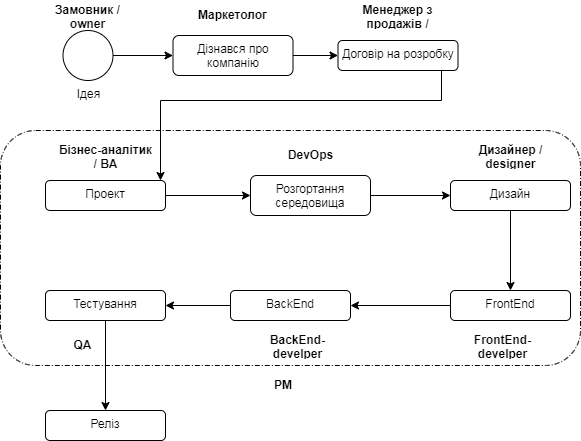
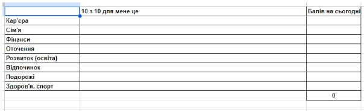
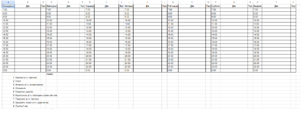
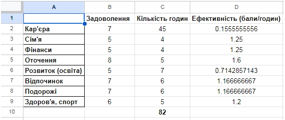

# Бізнес-аналіз. Вступ.
Головне завдання бізнес-аналітика – виявити проблеми бізнесу замовника та знайти максимально ефективне рішення. Для цього він повинен мати знання в предметній галузі. Бізнес-аналітик працює з вимогами на всіх етапах життєвого циклу розробки ПЗ та постійно виступає посередником між замовником та командою програмістів.  
  
Бізнес-аналітик – це особа, яка впроваджує зміни (changes) у бізнесі шляхом визначення потреб (needs) та рекомендації рішень (solutions), які забезпечують цінність (value) для зацікавлених осіб (stakeholders).  
  

Для формування первинної уяви про сферу пропонуємо познайомитись із цитатами практикуючих бізнес-аналітиків про процес їх роботи:  
>«Іноді аналітики скаржаться, що замовник сам не знає, чого хоче. Зазвичай саме замовник знає, а от аналітик не має достатніх аналітичних навичок, щоб зрозуміти його».  
  
>«Аналітик може мати хорошу англійську, підвішену мову та писати ідеальну документацію. Але якщо він не розуміється на предметній галузі, не може зрозуміти замовника і донести це до розробника, то його проекти провалюватимуться».  

>«Якість продукту – це якість вимог. Якість вимог – це аналітик».

>«Аналітик має позбутися вузької спрямованості мислення айтішника, вміти побачити картину в цілому, помічати недоліки. Чим краще йому вдасться вийти „за рамки“, тим успішною буде робота».

>«Ідеального ТЗ немає. Та воно й не потрібне, це колосальні витрати часу та грошей. Критика буде завжди, потрібно вчитися відокремлювати зерна від полови».

>«Все залежить від того, на якому етапі знаходиться проект. Колись можу займатися самоосвітою, колись писати документацію, чи вивчати документи, написані іншими, тестувати програму, спілкуватися із Замовником».

>«Мені подобається вигадувати гарні вирішення реальних проблем. Красиві — це логічні, універсальні, які лягають у структуру і самі стають масштабованою структурою, в яку потім ляжуть подальші зміни. Реальні проблеми - це першоджерела проблем замовника, вирішення яких прибере велику кількість "симптомів", з якими він до нас звернувся.

>«Люблю спілкуватися з людьми, впроваджувати в життя рішення, що полегшують комусь життя».
  
>«Подобається займатися структуруванням інформації, оптимізацією, виявляти творчість. Комуніцювати на всіх рівнях — із зацікавленими особами та кінцевими користувачами, розробниками, менеджерами, тестувальниками, дизайнерами та адмінами. Справжня влада над проектом ^_^»

## Типовий день бізнес-аналітика.
Типовий робочий день бізнес-аналітика - це:  
- Мітинги з проектною командою та із замовником;  
- Опрацювання концептуальних рішень;  
- Робота з інструментами аналізу: схемами, діаграмами, моделями, прототипами;  
- Робота з вимогами: збирання, написання ТЗ та специфікацій;  
- Консультації розробників та тестувальників;  
- Вивчення стандартів.  

Для практичного знайомства із ринком праці бізнес-аналітиків рекомендуємо зайти на сайт  dou.ua в розділ [Analyst](https://jobs.dou.ua/vacancies/?category=Analyst)

## Мета курсу:
* Дати студентам курсу уявлення про типовий процес розробки програмного забезпечення: ідея, ТЗ, прототип, проект, дизайн, верстка, програмування, тестування, підготовка контенту, наповнення контентом, системи ІІ, тестування.

* Дати уявлення про бізнес-вимоги замовника: прибуток/витрати, визначеність/невизначеність, терміни, імідж, ін.

* Для того, щоб включити студентів у напрямку розуміння бізнес-вимог – проаналізувати власні бізнес-вимоги, після освоєння – проаналізувати бізнес-вимоги іншої людини.

Для цього - ми познайомимося в цілому із сферою розробки програмного забезпечення.  
В процесі навчання, ми будемо реалізовувати продукт, в якому зацікавлена цільова аудиторія, представником якої є ви. А для оцінки її запитів проведемо певне дослідження.

## SoftWare development WorkFlow
Процес розробки програмного забезпечення на загальному рівні можна пердставити наступним чином:
  

* **Замовник.** В замовника зароджується ідея проекту, а також він знаходить ресурси на реалізацію проекту. 
На вході: ідея, на виході - запит до виконавця.
Замовник йде до Sales-менеджера.
* **Маркетолог.** Створює рекламну воронку за якою зацікавлений замовник може попасти до Sales-менеджера. Запускає рекламу.
На вході: пропозиція на виході ліди.
Забезпечення того, що замовник прийде до  Sales-менеджера.
* **Sales-менеджер.** Презентує компанію та її можливості. Обговорює умови, забезпечує підписання контакту та отримання оплати.
На вході: зацікавлений замовник (лід) на виході - контракт і оплата.
* **Архітектор проекту.** Обирає технології для реалізації проектів, описує технічні задачі для реалізації проекту. Створює прототипи та вимоги функціональності проекту, перелік ендпоінтів, структуру базу даних.
На вході: контаракт, на виході - описаний проект.
* **Дизайнер.** Готує графічні рішення для проекту.
На вході: прототипи, на виході - графічне рішення.
* **Верстальник/FrontEnd-розробник.** Створює інтерфейс (технічні рішення з якими буде працювати користувач).
На вході: картинка, на виході - шаблон інтерфейсу.
BackEnd-розробник. Розробляє серверні програми для проекту.
На вході: функціональні вимоги, структура бази даних, структура енд-поінтів. На виході - сервени програма, ендпоінт
* **DataScientist.** Розробляє схему роботи з даними та впроваджує її в роботу серверної частини програми.
На вході: модель роботи з базами даних, на виході - працюючий код по роботі з даними.
* **Business Analyst (BA).** Створює перелік вимог, пріоретизує їх. Доводить вимоги до технічної команди.
На вході: запит від замовника, структура проекта. На виході: пріоритезований перелік вимог (бек-лог).
* **Project Manager (PM).** Супроводжує процес розробки. Забезпечує відповідність строкам, якості, бюджету та щастю команди.
На вході:  проект та вимоги до нього. На виході - реалізовані плани.
* **Quality Assurance (QA).** Перевіряє розробку на відповідність вимогами, які сформовани за проектом. Іноді - написання Юніт-тестів.
Не вході: не перевірений програмний код, На виході: зауваження до коду (повернення на доопрацювання). Погодження відповідності якості.
* **Product owner (PO)** - за умови продуктової розробки - керує повністю процесом розробки та її комерціалізації.
	На вході: процес розробки продукту, на виході - прибутковий продукт.
Копірайтер. Готує (пише) тексти для застосунку.
На вході: запит на текст. На виході: готовий текст.
* **Контент-менеджер:** Розміщує тексти.
На вході: тексти, на виході: тексти, що їх розміщено на сайті.

Зробимо схему процесу:  

## Власні ресурси:
### Колесо життєвого балансу
Життя є різностороннім і для повноцінного життя мають бути задоволені не тільки рівні мотивації, але й сфери життя. Для сприйняття сфер життя зрочно використовувати таку техніку, як колесо життєвого балансу. Дана техніка запропонована Полом Дж. Майєром. Ми її використовуємо для того, щоб сформувати напрямок мотивації та визначити те місце, яке в вашому житті займає освіта.  
  
  

Ми спочатку заповнюємо другий стовпчик, в який вписуєте вашу мрію, а далі - оцінюєте скільки балів з цього ми маєте сьогодні. 
Таким чином, ви зафіксуєте ваші бажання і можете оцінити те, наскільки близько ви наблизились до досягнення власних цілей.
Проте ваші досягнення не на пустому місці. У вас є певний час за добу. І основним інструментом управління вашим життям і вашим навчанням - це розподіл часу впродовж тижня.

  
В результаті - обрахуйте вашу ефективність - за який час ви досягаєте певний рівень задоволення ваших потреб.  
  
  
І тут - ми використаємо трохи математичного апарату.
Практичне завдання:
Сплануйте ваш тиждень так, щоб рівень задоволення змінився в більшу сторону (робіть більше справ, які вам приносять більше задоволення. Додатковий час отримайте з перерозподілу непродуктивного часу, а також зі зменшенням вкладання часу ві сери, які удільно вам приносять менше задоволення.  
  

https://docs.google.com/spreadsheets/d/1TyLuzQhpHJyH4jCtp6l-0VgMuSb-I5QLfdztmdlMTyo/edit  